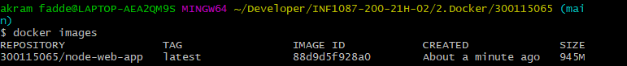

# 📌Dockeriser une application web Node.js

Le but de cet exemple est de montrer comment mettre une application Node.js dans un conteneur Docker. 

## :one: Créer l'application Node.js
💡 Tout d'abord, créez un nouveau répertoire où tous les fichiers seront placés. Dans ce répertoire, créez un fichier `package.json` qui décrit votre application.

```
{
  "name": "docker_web_app",
  "version": "1.0.0",
  "description": "Node.js on Docker",
  "author": "abdel fadde <abdel.fadde@gmail.com>",
  "main": "server.js",
  "scripts": {
    "start": "node server.js"
  },
  "dependencies": {
    "express": "^4.16.1"
  }
}

```

Avec votre nouveau fichier package.json, exécutez 'npm install'

💡 Ensuite, créez un fichier server.js qui définit une application Web utilisant le Express.js framework


```
use strict';

const express = require('express');

// Constants
const PORT = 8080;
const HOST = '0.0.0.0';

// App
const app = express();
app.get('/', (req, res) => {
  res.send('Hello World');
});

app.listen(PORT, HOST);
console.log(`Running on http://${HOST}:${PORT}`);

```

💡 Construire une image Docker de votre application en créant un Dockerfile


```
FROM node:14

# Create app directory
WORKDIR /usr/src/app

# Install app dependencies
# A wildcard is used to ensure both package.json AND package-lock.json are copied
# where available (npm@5+)
COPY package*.json ./

RUN npm install
# If you are building your code for production
# RUN npm ci --only=production

# Bundle app source
COPY . .

EXPOSE 8080
CMD [ "node", "server.js" ]

```
💡 Créez un fichier .dockerignore dans le même répertoire que votre Dockerfile avec le contenu suivant :

```
node_modules
npm-debug.log
```
Cela empêchera vos modules locaux et vos logs de débogage d'être copiés sur votre image Docker et d'écraser éventuellement les modules installés dans votre image.

## :two: Construire votre image
💡 Allez dans le répertoire qui contient votre Dockerfile et exécutez la commande suivante pour construire l'image Docker.

```
docker build -t 300115065/node-web-app .
```
Pour lister votre image par Docker :
```
docker images
```


## :three: Exécuter l'image
```
$ docker run -p 49160:8080 -d 300115065/node-web-app
a0c513256189d653188b4acd0171850b943027779140a3f321ab71e6cb4552c2
```
### Get container ID
```
$ docker ps
CONTAINER ID        IMAGE                    COMMAND                  CREATED             STATUS              PORTS                     NAMES
a0c513256189        300115065/node-web-app   "docker-entrypoint.s…"   3 minutes ago       Up 3 minutes 
```
### Print app output
```
$ docker logs a0c513256189      -- container ID
Running on http://0.0.0.0:8080
```

## :four: Test
```
$ curl -i localhost:49160

![image](Testt.png
```
