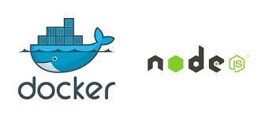

#  Dockerizing a Node.js web app

 

Le but de cet exemple est de vous montrer comment obtenir une application Node.js dans un conteneur Docker. Le guide est destiné au développement et non au déploiement en production. Le guide suppose également que vous avez une installation Docker fonctionnelle et une compréhension de base de la structure d’une application Node.js.

## SOMMAIRE

:one: Creer un fichier Node.js app

:two: Creer un dockerfile

:three: Creer le fichier .dockerignore 

:four: Construire l'image

:five: Executer l'image

:six: Test

### :one: Creer l'app Node.js 

Tout d’abord, créer un nouveau répertoire où tous les fichiers resideront. Dans ce répertoire, créez un fichier package.json qui décrit votre application et ses dépendances :

    {
      "name": "docker_web_app",
      "version": "1.0.0",
      "description": "Node.js on Docker",
      "author": "First Last <first.last@example.com>",
      "main": "server.js",
      "scripts": {
        "start": "node server.js"
      },
      "dependencies": {
        "express": "^4.16.1"
      }
    }
 
Avec votre nouveau fichier package.json, exécutez npm install. Si vous utilisez npm version 5 ou ultérieure, cela générera un fichier package-lock.json qui sera copié sur votre image Docker.

**Ensuite, créez un fichier server.js qui définit une application web en utilisant le framework Express.js :**

    'use strict';

    const express = require('express');

    // Constants
    const PORT = 8080;
    const HOST = '0.0.0.0';

    // App
    const app = express();
    app.get('/', (req, res) => {
      res.send('Hello World');
    });

    app.listen(PORT, HOST);
    console.log(`Running on http://${HOST}:${PORT}`);
    
Dans les prochaines étapes, nous verrons comment vous pouvez exécuter cette application dans un conteneur Docker en utilisant l’image officielle de Docker. Tout d’abord, vous devrez créer une image Docker de votre application.

### :two: Creating a Dockerfile

Créer un fichier vide appelé Dockerfile :

    touch Dockerfile
    
Ouvrez le Dockerfile dans votre éditeur de texte préféré, dans notre cas ce sera notepad

     $ notepad Dockerfile

La première chose que nous devons faire est de définir à partir de quelle image nous voulons construire. Nous utiliserons ici la dernière version LTS (support à long terme) du nœud disponible sur le Docker Hub :
    FROM node:10

Ensuite, nous créons un répertoire pour contenir le code de l’application à l’intérieur de l’image, ce sera le répertoire de travail pour votre application :

   *Create app directory*

    WORKDIR /usr/src/app
    
Cette image est livrée avec Node.js et NPM déjà installés donc la prochaine chose que nous devons faire est d’installer vos dépendances app en utilisant le binaire npm. Veuillez noter que si vous utilisez npm version 4 ou une version antérieure, un fichier package-lock.json ne sera pas généré.

    # Install app dependencies
    # A wildcard is used to ensure both package.json AND package-lock.json are copied
    # where available (npm@5+)
    COPY package*.json ./

    RUN npm install
    # If you are building your code for production
    # RUN npm ci --only=production
    
Note that, rather than copying the entire working directory, we are only copying the package.json file. This allows us to take advantage of cached Docker layers. bitJudo has a good explanation of this here. Furthermore, the npm ci command, specified in the comments, helps provide faster, reliable, reproducible builds for production environments. You can read more about this here.

To bundle your app's source code inside the Docker image, use the COPY instruction:

    # Bundle app source
    COPY . .
    
Your app binds to port 8080 so you'll use the EXPOSE instruction to have it mapped by the docker daemon:

    EXPOSE 8080
    
Last but not least, define the command to run your app using CMD which defines your runtime. Here we will use node server.js to start your server:

    CMD [ "node", "server.js" ]
    
Your Dockerfile should now look like this:

    FROM node:10

    # Create app directory
    WORKDIR /usr/src/app

    # Install app dependencies
    # A wildcard is used to ensure both package.json AND package-lock.json are copied
    # where available (npm@5+)
    COPY package*.json ./

    RUN npm install
    # If you are building your code for production
    # RUN npm ci --only=production

    # Bundle app source
    COPY . .

    EXPOSE 8080
    CMD [ "node", "server.js" ]
    
**.dockerignore file**

Create a .dockerignore file in the same directory as your Dockerfile with following content:

    node_modules
    npm-debug.log
    
This will prevent your local modules and debug logs from being copied onto your Docker image and possibly overwriting modules installed within your image.

Building your image
Go to the directory that has your Dockerfile and run the following command to build the Docker image. The -t flag lets you tag your image so it's easier to find later using the docker images command:

docker build -t <your username>/node-web-app .
Your image will now be listed by Docker:

$ docker images

# Example
REPOSITORY                      TAG        ID              CREATED
node                            10         1934b0b038d1    5 days ago
<your username>/node-web-app    latest     d64d3505b0d2    1 minute ago
Run the image
Running your image with -d runs the container in detached mode, leaving the container running in the background. The -p flag redirects a public port to a private port inside the container. Run the image you previously built:

docker run -p 49160:8080 -d <your username>/node-web-app
Print the output of your app:

    # Get container ID
    $ docker ps

    # Print app output
    $ docker logs <container id>

    # Example
    Running on http://localhost:8080
    
If you need to go inside the container you can use the exec command:

# Enter the container
$ docker exec -it <container id> /bin/bash
Test
To test your app, get the port of your app that Docker mapped:

$ docker ps

# Example
ID            IMAGE                                COMMAND    ...   PORTS
ecce33b30ebf  <your username>/node-web-app:latest  npm start  ...   49160->8080
In the example above, Docker mapped the 8080 port inside of the container to the port 49160 on your machine.

Now you can call your app using curl (install if needed via: sudo apt-get install curl):

$ curl -i localhost:49160

HTTP/1.1 200 OK
X-Powered-By: Express
Content-Type: text/html; charset=utf-8
Content-Length: 12
ETag: W/"c-M6tWOb/Y57lesdjQuHeB1P/qTV0"
Date: Mon, 13 Nov 2017 20:53:59 GMT
Connection: keep-alive

Hello world
We hope this tutorial helped you get up and running a simple Node.js application on Docker.

You can find more information about Docker and Node.js 
