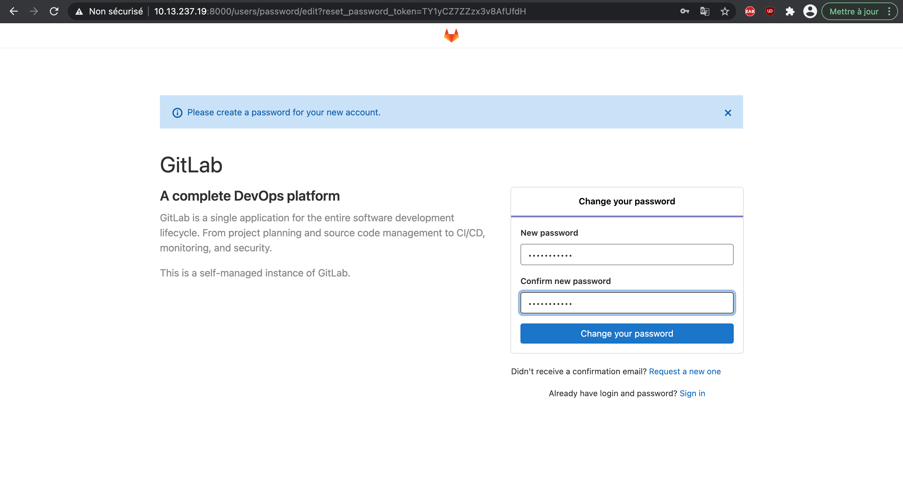
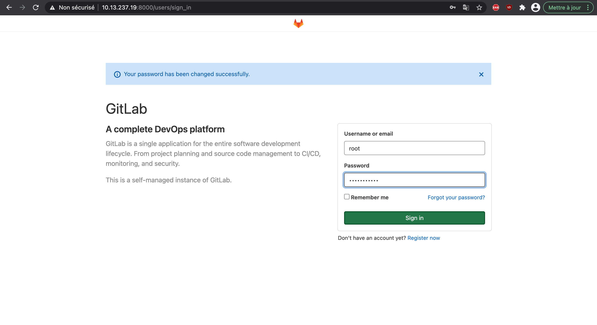
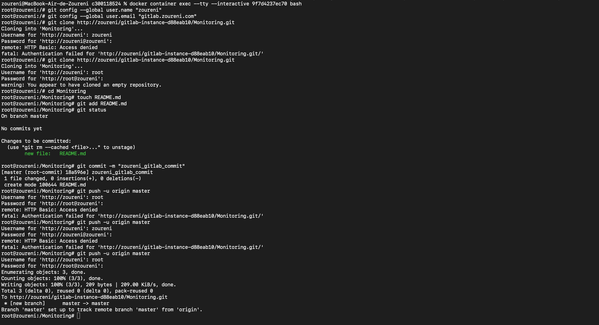
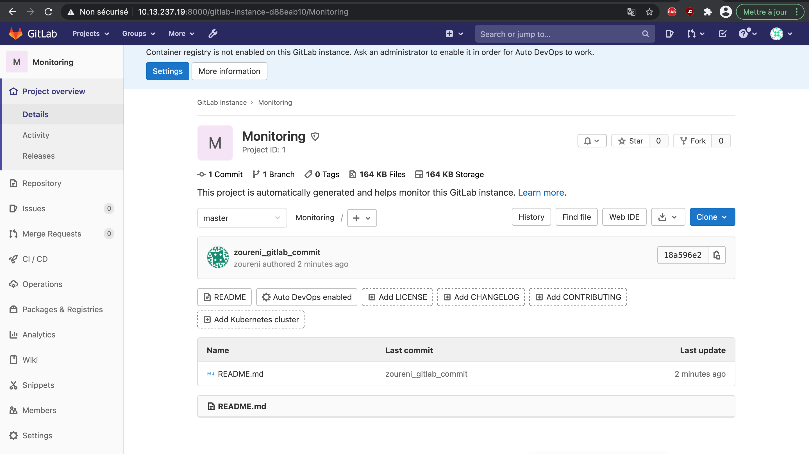
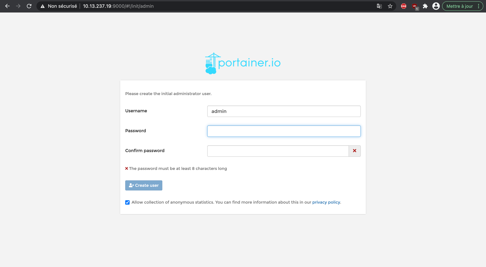
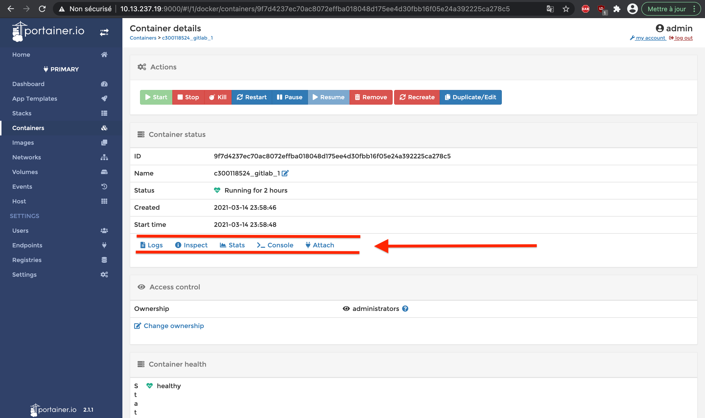
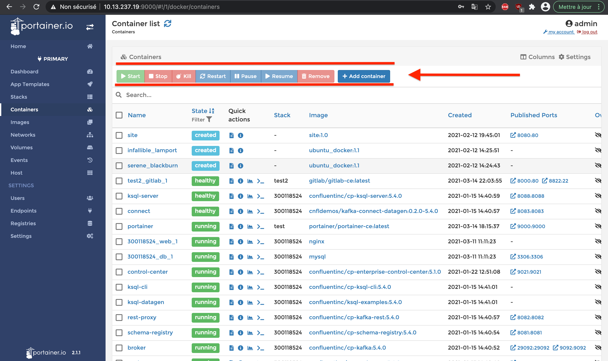
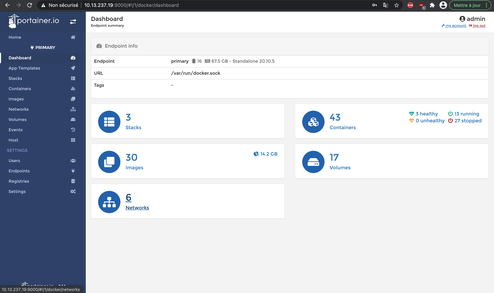
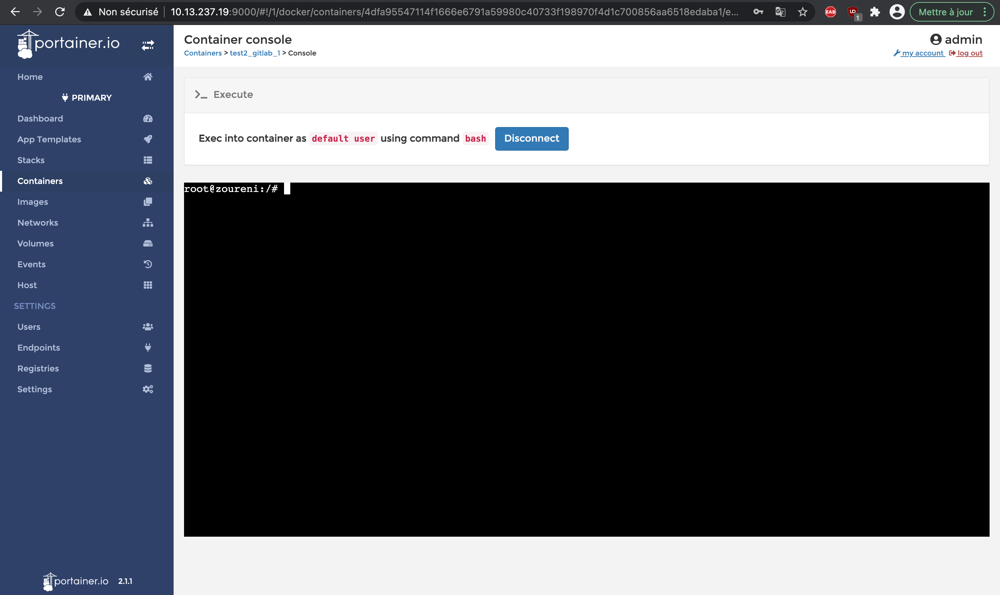

# DOCKER-COMPOSE.YML

## exécution du docker-compose :100:

`docker-compose up --detach`

### vérification :white_check_mark:

`docker-compose ps`
```

```

`--------------------------------------------------------------------------------------------------`
## Démonstration du docker-compose.yml :wrench:

### Notre docker-compose est composé de :balloon: 2 container

## container :one: : gitlab
```
```
### :a: Démonstration sur le navigateur

#### :volcano: Determiner votre mot de passe

:point_down:



:speech_balloon: Connecter vous avec **username** = `root` **mot de passe** = `le mot de passe que vous venez de définir` :point_up:



:boom: Et voilà vous pouvez gérer vos projets :boom:

#### :b: Démonstration avec le CLI

- dans ce cas

   - connexion à la console gitlab `docker container exec --tty --interactive 9f7d4237ec70 bash`
   
   - configuration `git config --global user.name "zoureni"` `git config --global user.email "gitlab.zoureni.com"`
   
   - accès au projet Monitoring `cd Monitoring`
   
   - clone  `git clone http://zoureni/gitlab-instance-d88eab10/Monitoring.git`
   
   - création de fichier README.md `touch README.md`
   
   - ajouter et commit et push au projet

  
 
Aperçu sur le navigateur

 

```

```
`--------------------------------------------------------------------------------------------------`
## container :two: : portainer
```
```

### :a: :volcano: Determiner votre mot de passe

:point_down:



### :b: À quoi sert ce container :question:

- monitorer les container

   • Voir les ressources utilisées
   
   •	voir les logs des container
   
   •	inspecter la configuration des container…
   


- gérer les container

   •	créer des container
   
   •	supprimer des container
   
   •	régénérer des container
   
   •	éditer des container
   
   •	redéployer des container
   
   •	démarrer des container
   
   •	éteindre des container
   
   •	redémarrer des container
   
   •	tuer des container
   
   •	mettre en pause des container
   


•	Gérer les images Docker

•	Gérer les réseaux

•	Gérer les volumes…


```
```
 •	Accéder aux consoles de différent container
 
 
