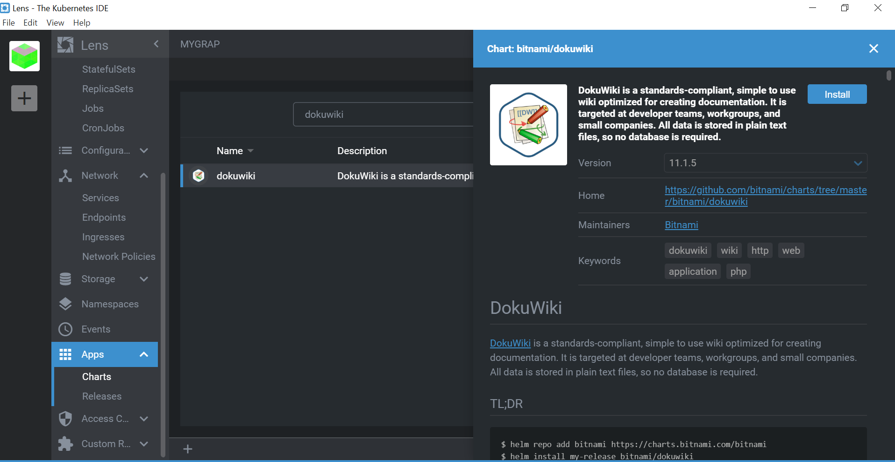

# 🍇INSTALLER DOKUWIKI AVEC LENS EN UTILISANT LES SERVICES KUBERNETES AZURE 🍇

## PRÉRÉQUIS

Sur votre PC:

:round_pushpin: Installer [kubectl](https://github.com/CollegeBoreal/Tutoriels/blob/main/2.MicroServices/3.Orchestration/1.Kubernetes/README.md#a-kubectl-client)

:round_pushpin: Installer [Lens](https://github.com/CollegeBoreal/Tutoriels/blob/main/2.MicroServices/3.Orchestration/1.Kubernetes/README.md#star-ide)

## ⚙️ INSTALLATION AVEC LENS⚙️

### 🅰️ OUVRIR L'ONGLET APPS DANS L'APPLICATION LENS

Après avoir ouvert l'onglet apps:

cliquez sur **Charts** 

puis dans la barre de recherche puis entrez le nom de l'application que vous souhaitez installer. Dans notre cas il s'Agit de DOKUWIKI

cliquez sur Install

