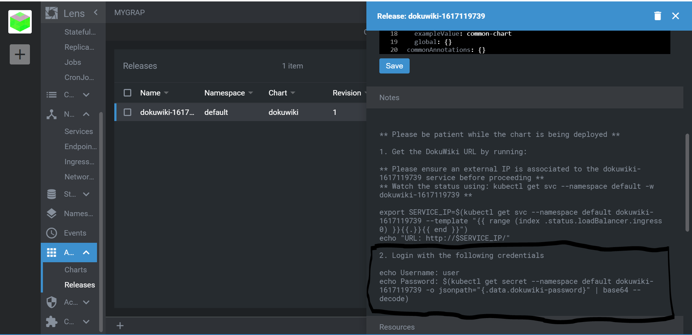
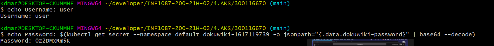
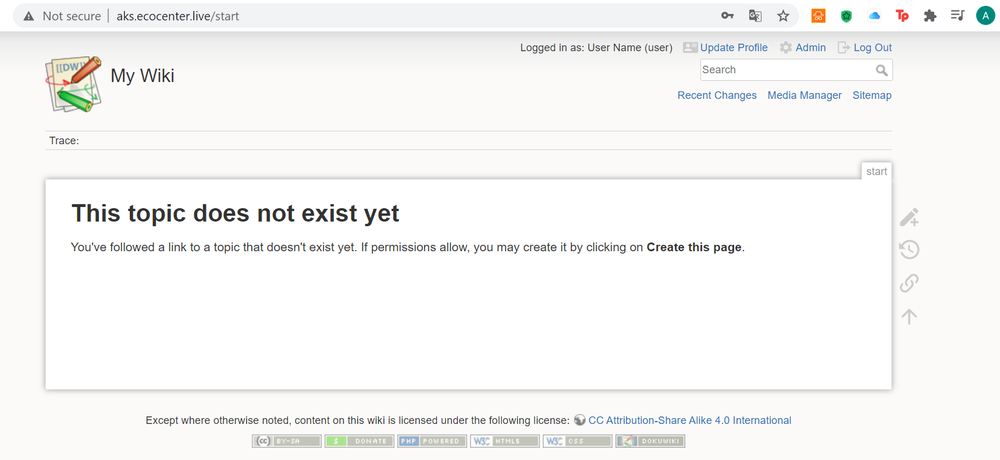

# 🍇INSTALLER DOKUWIKI AVEC LENS EN UTILISANT LES SERVICES KUBERNETES AZURE 🍇

## PRÉRÉQUIS

Sur votre PC:

:round_pushpin: Installer [kubectl](https://github.com/CollegeBoreal/Tutoriels/blob/main/2.MicroServices/3.Orchestration/1.Kubernetes/README.md#a-kubectl-client)

:round_pushpin: Installer [Lens](https://github.com/CollegeBoreal/Tutoriels/blob/main/2.MicroServices/3.Orchestration/1.Kubernetes/README.md#star-ide)

## ⚙️ INSTALLATION AVEC LENS⚙️

### 🅰️ OUVRIR L'ONGLET APPS DANS L'APPLICATION LENS

   **I/PREMIERE ÉTAPE: INSTALLER**

   Après avoir ouvert l'onglet apps:

   ✔️Cliquez sur **Charts** 

   ✔️Dans la barre de recherche puis entrez le nom de l'application que vous souhaitez installer. Dans notre cas il s'Agit de DOKUWIKI

   ✔️Cliquez sur Install

   **II/ 🔑 DEUXIEME ETAPE: OBTENIR LES CREDENTIALS 🔑**
   
   Dans le meme onglet(APPS):
   
   ✔️Cliquez sur **Releases** 
   
   ✔️Cliquez sur votre release nommé **dokuwiki** et une fenetre apparaitra sur la droite de votre écran. Allez vers le bas.
   
   ✔️Copier la zone encadrée ci-dessous sur l'image 
   
   
   
   ✔️Coller la commnande dnas un terminal, pour ma part j'ai utilisé Gitbash
   
   
   
### :b: SE CONNECTER À DOKUWIKI

 **I/PREMIERE ÉTAPE: Avec l'adresse IP**

   ✔️ Ouvrir l'onglet **Network**

   ✔️Ouvrir **Services** dans le meme onglet ainsi vous pourrez récuper votre adresse IP
   ✔️Ouvrez votre navigateur et entrer l'adresse IP dans la barre de recherche
    suivie de admin .Vous pourrez alors utilisez les credentials récuperer plus haut pour vous connecter.
    
   
   
   
**II/DEUXIÈME ÉTAPE: A partir d'un nom de domaine**
   
 
 
 

   
   
   
   

