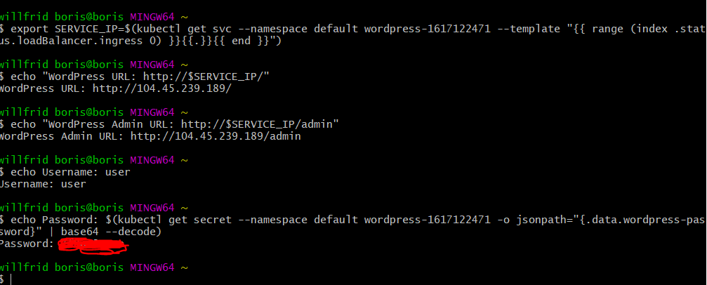
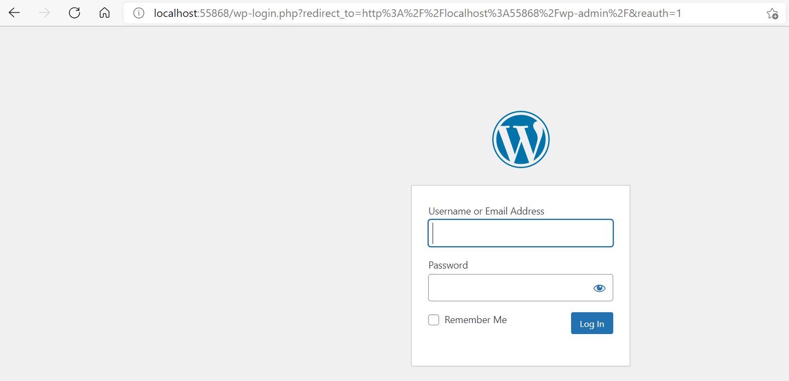

## AKS -LENS Wordpress

after installing AKS CLI AND LENS

:one: check the status wordpress

:two:voir l'addresse ip avec le menu Network

:three: Testez sur le Navigateur

:four: Recuperez vos identifiants

:four: Entez vos Identifiants

