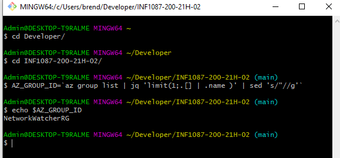

# :monkey::palm_tree::tiger2:Installer de Moodle avec kubernetes services apartie de Lens

## :lollipop: se connecter à Azure en utilisant les commandes CLI 

## :pineapple: Créer sa grappe et Vérifier que le groupe existe

## :cat2:

![image](images/d4.PNG
