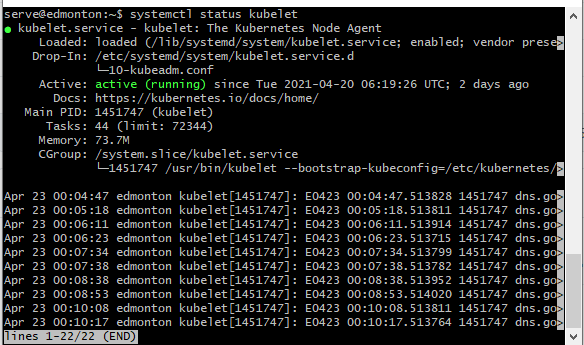
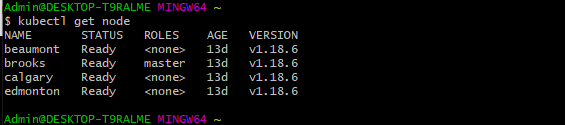
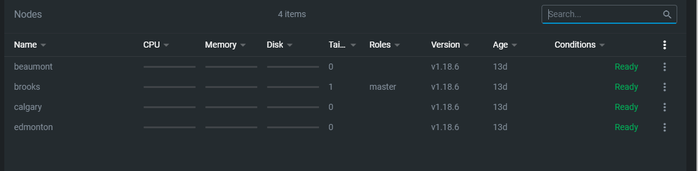
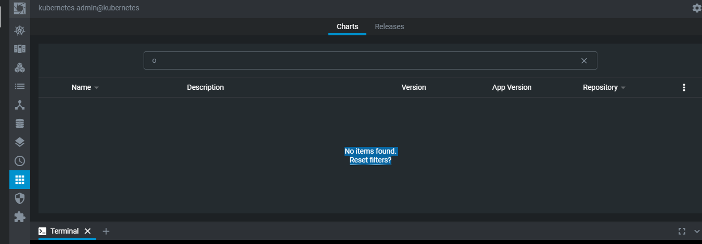

# :computer: Deployement et d'applications OrangeHRM sur Lens 

:balloon: Premierement je vérifie si Kubernetes est mode "Running"

:balloon: Vérifier si les nodes de la grappe sont en bon état

:balloon: Vérifie si les nodes de la grappes sont mode Ready

## :mag: Installer l'application OrangeHRM

:sweat: La liste de mes application est vide
