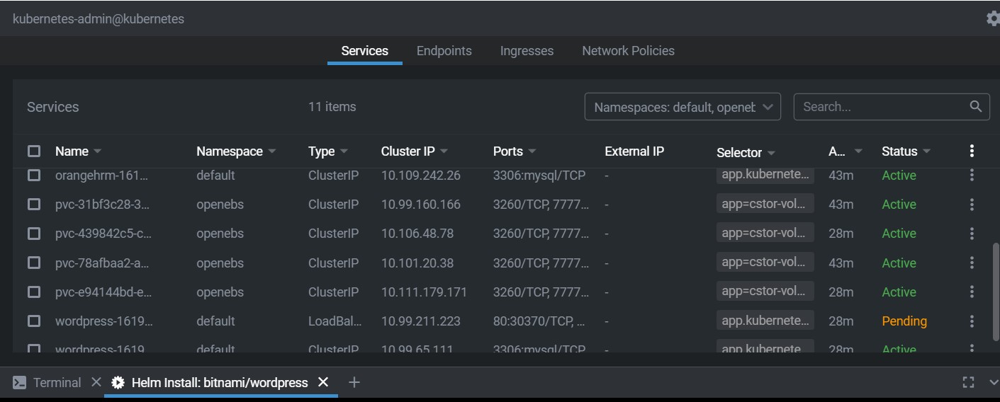
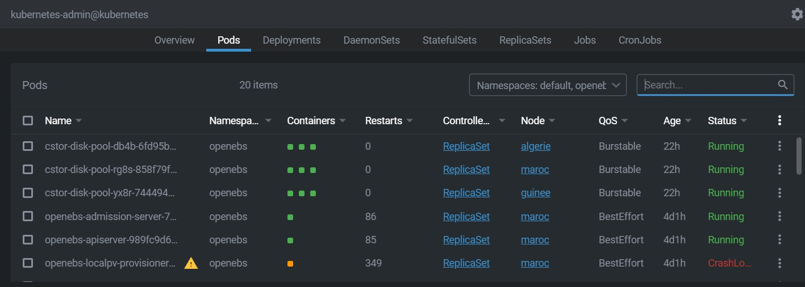
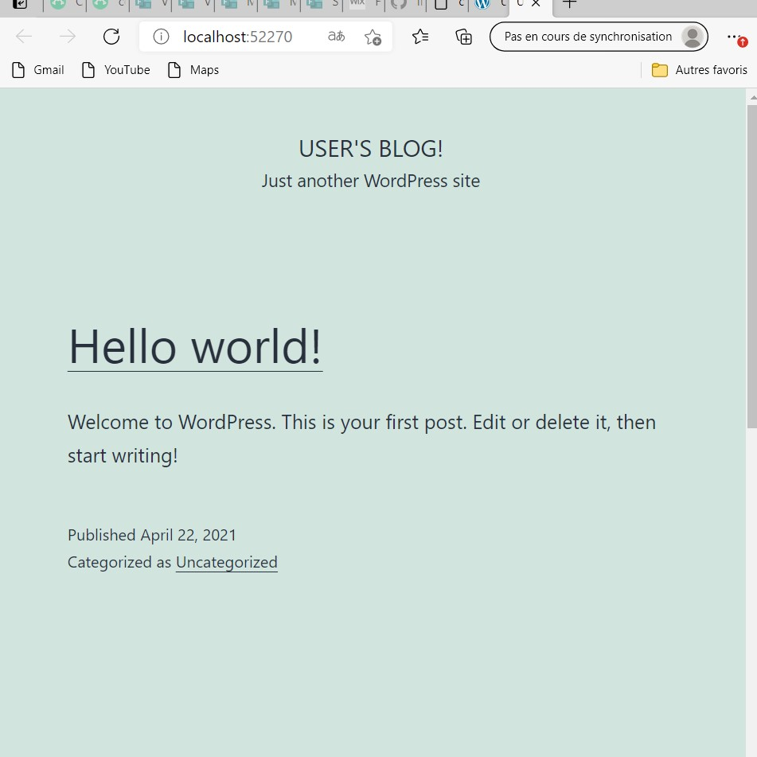

# :computer: Deployement d'applications sur Lens et la grappe Africa

## :apple: Verification de Kubernetes (actif et en mode runnin) c'est okay 

## :computer: les nodes de la grappes Africa marche apres verification

A ce niveau ca veut dire que les grappe pret

## 🐍: Le fichier de configuration

## 🍍: Installation de l'application ensuite on va mettre l'identifiant de l;application sur le fichier config

## :computer: Execution du fichier config sur le PC

## 🥦: Verification sur Lens si ca running

## 🍏: l'application installee marche

