# Installer Graphana avec kubernetes dans lens

Pour le faire il faut allez dans APPS dans lens et choisi l'application que vous voulez installer

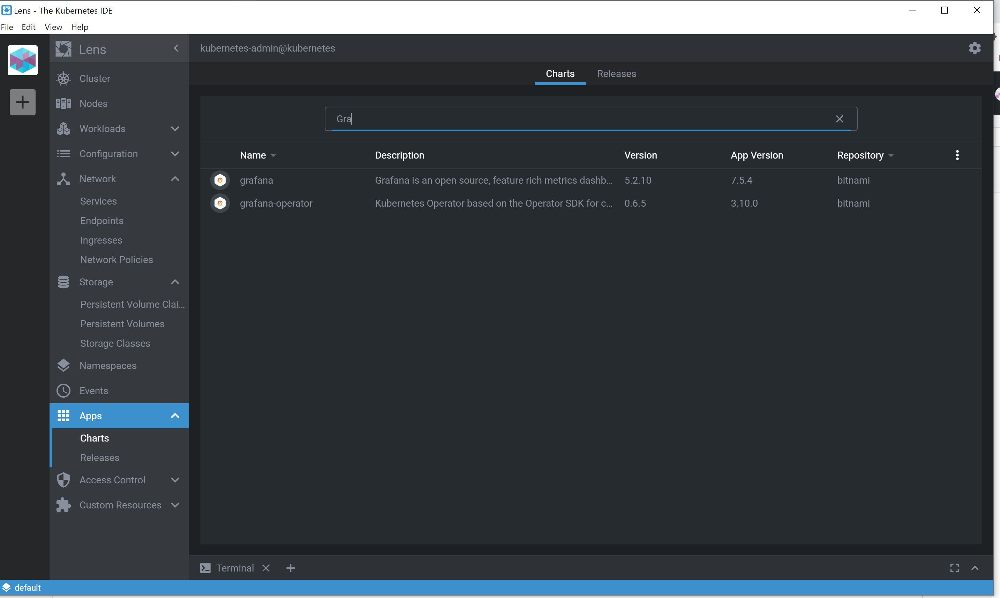

Une fois que vous avez choisir l'application a installer cliquez dessus une page va s'ouvrir pour vous permettre d'installer

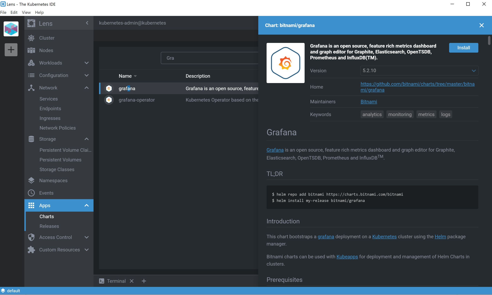

Une fois la fenetre ouverte cliquez sur install

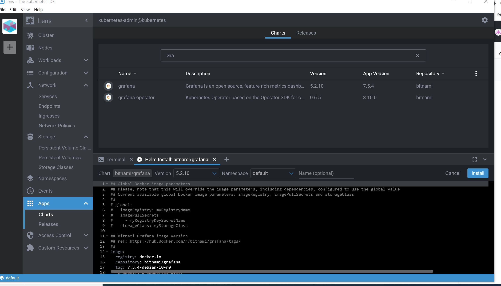

L'installation a ete reussit

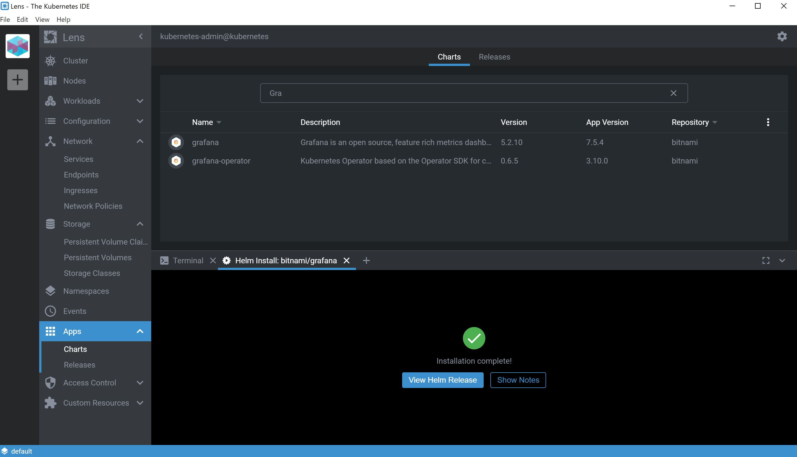

Allez dans APPs, puis release pour verifier 

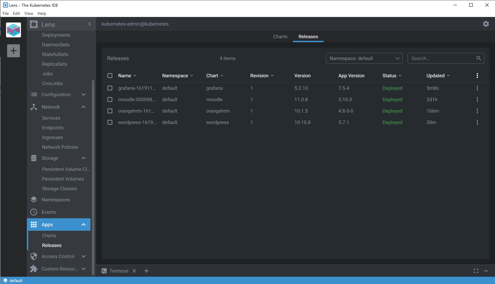

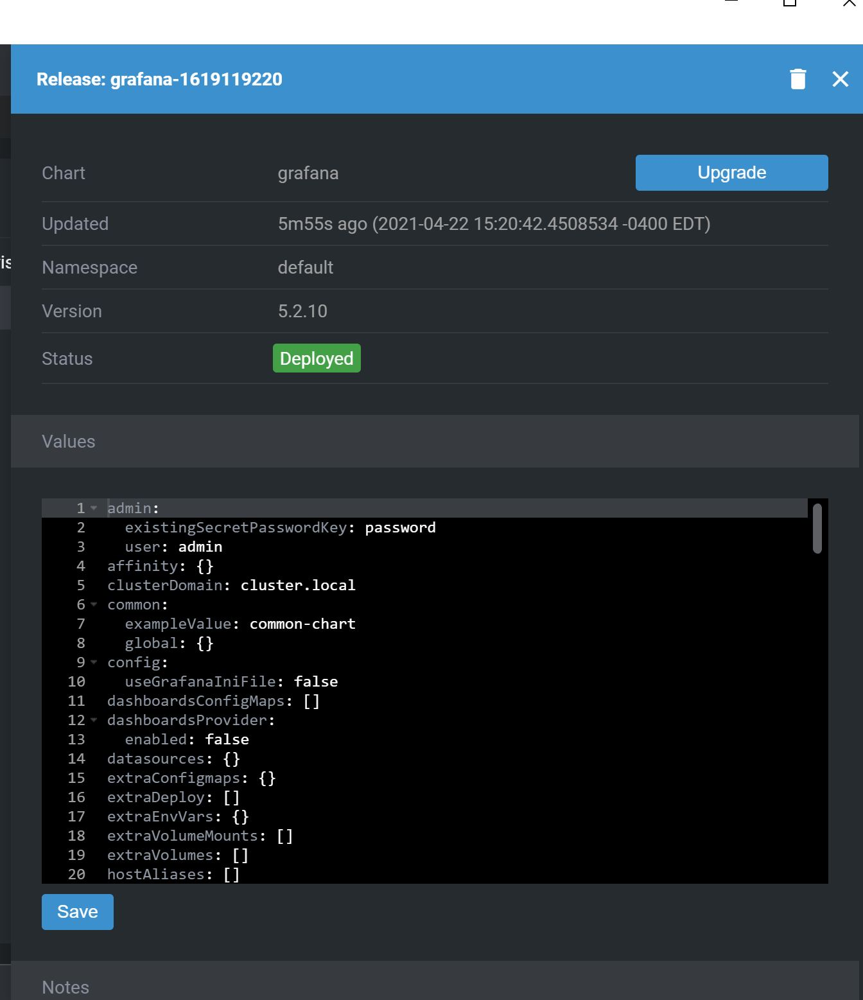

Allez dans votre serveur pour l'installer

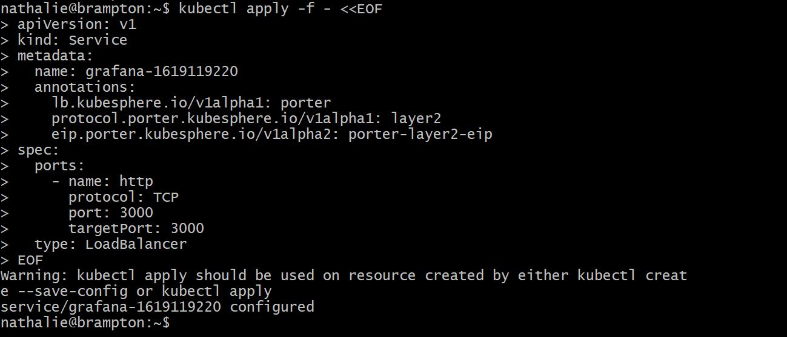

Verifier l'installation dans network puis service. Malheureuse nous n'arrivons pas a ouvrir notre application en cliquant sur le port

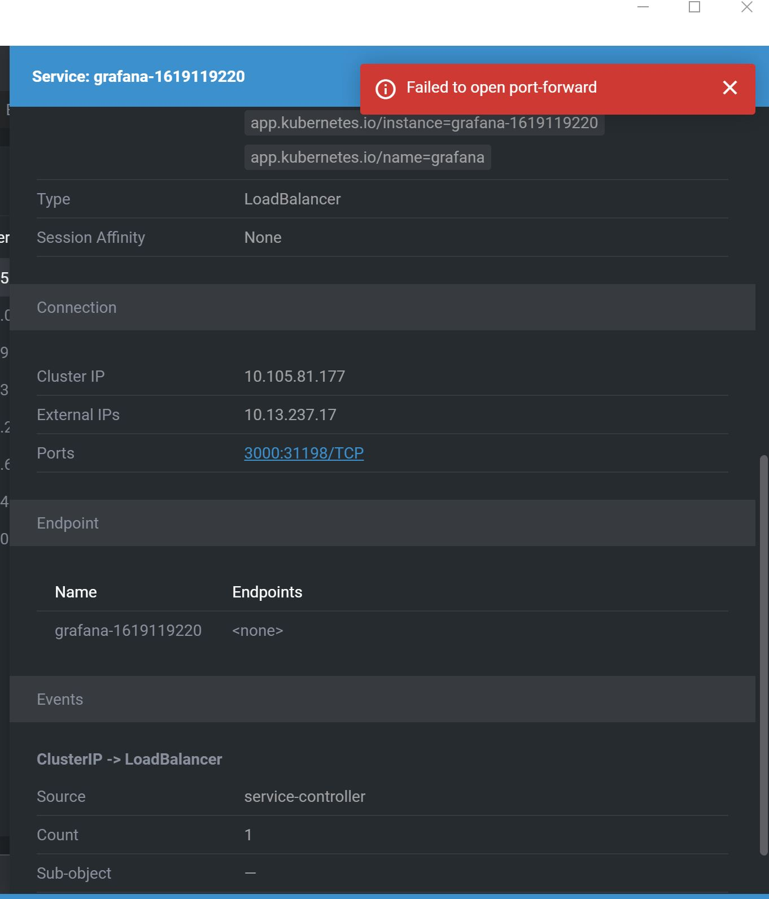

Verifier egalement dans deploiement

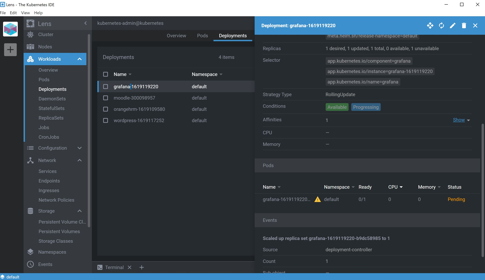

Puis verifier dans Pod

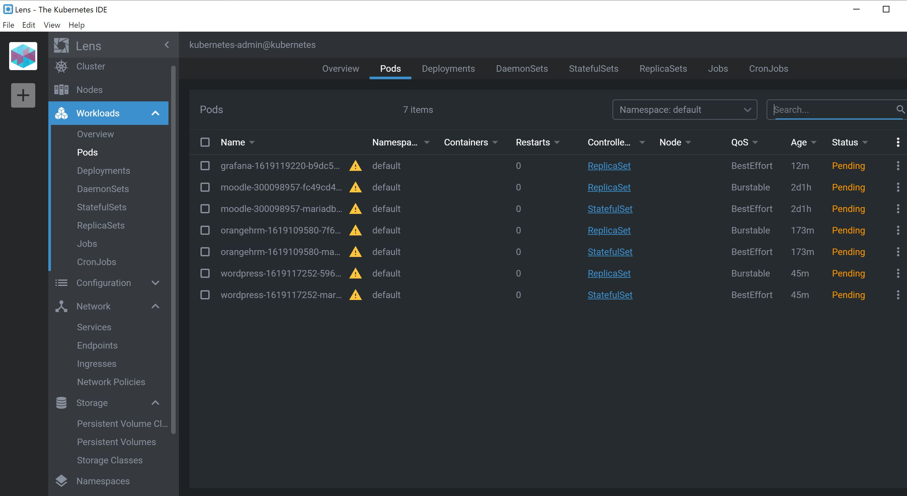

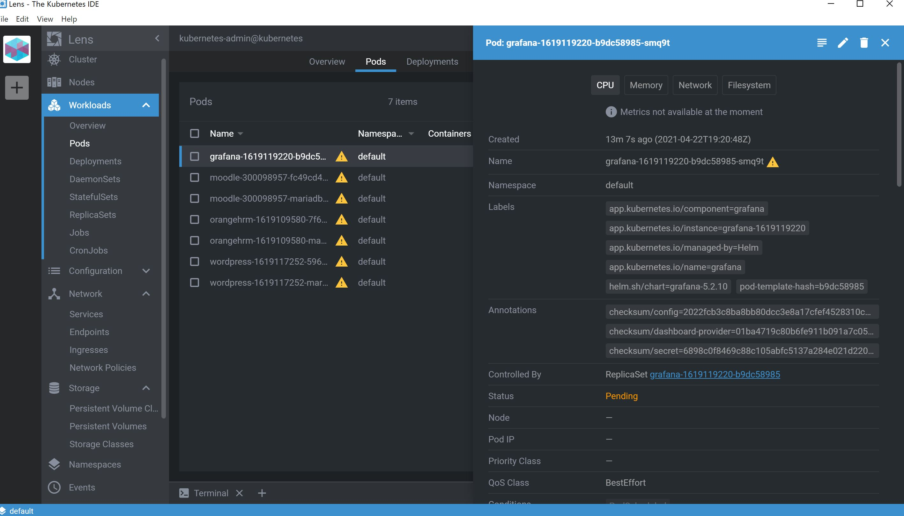

Malheureusement nous n'arrivons pas a ouvrir notre application a cause d'un probleme de stockage.

