 ## 🃏 Preparation du serveur
 

🐴: Assurez-vous que vous avez le bon nom d'hôte (en fonction de votre cluster) 
 ----------------------------------------------------------------------------
 ▪️ toronto

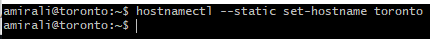

🐋: Désactiver le swap (sinon Kubernetes ne fonctionnera pas)
--------------------------------------------------------------
▪️:swap

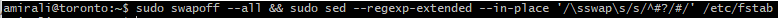

🤸:Désactivé swap  au démarrage dans le file/etc/fstab
------------------------------------------------------------
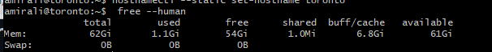

🪀 Vérifiez que l'échange dans /etc/fstab est commentee
----------------------------------------------------
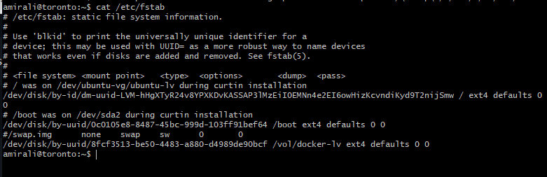

🎍 voir le pont
-----------------
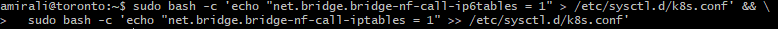

☔:recharger la configuration
------------------------
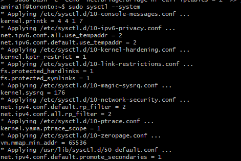

## 🃏:Installation des outils

☁️: installer google cloud 
--------------------------
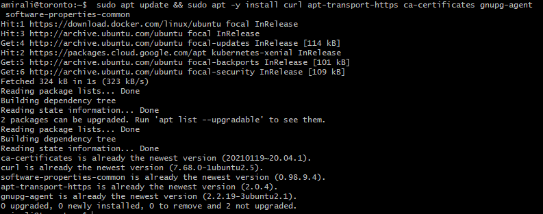

🔑: Ajouter la clé PGP
-------------------
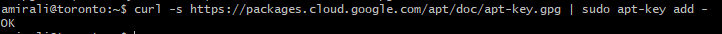

◾ Vérifier que l'empreinte de la clé

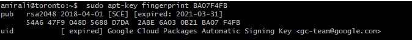

💀: Ajouter le fichier kubernetes debian au référentiel
--------------------------------------------------------
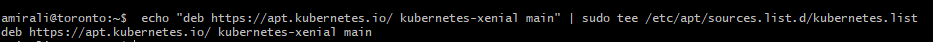

## 🃏  Installer kubeadm and kubectl

▪️: Choisir une version spécifique de Kubernetes

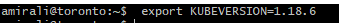

🚆: Installer la version spécifique de Kubernetes
---------------------------------------------------
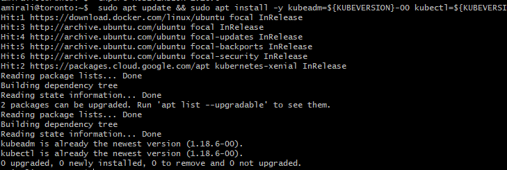

🍏:  Prévenir l'altération (mise à jour) des outils
----------------------------------------------------
 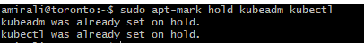
 
 🧪: Tester que les outils sont installés
 ------------------------------------------
  
  
  ## 🥑: domain 
 ▪️ ping a mon domain 
 
 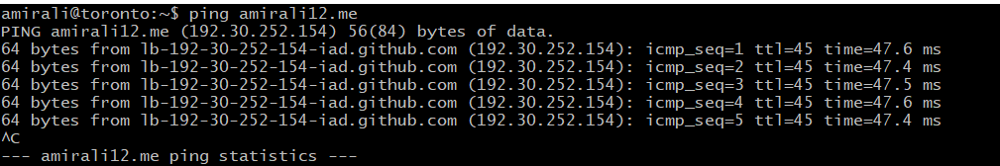                                     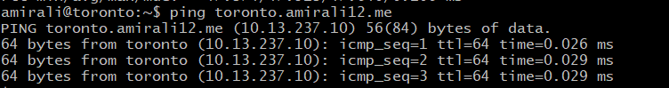        

 
  
  
  
## 🃏: Les plans

🥖: Installer le plan de contrôle ✍️
-------------------------------------

▪️  Télécharger les images 

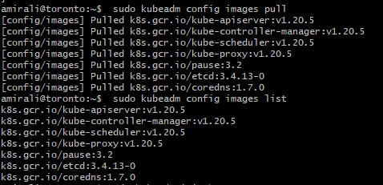

▪️ Véfifier l'installation des images

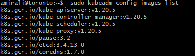

 🎛️ Initialiser la grappe
 -------------------------
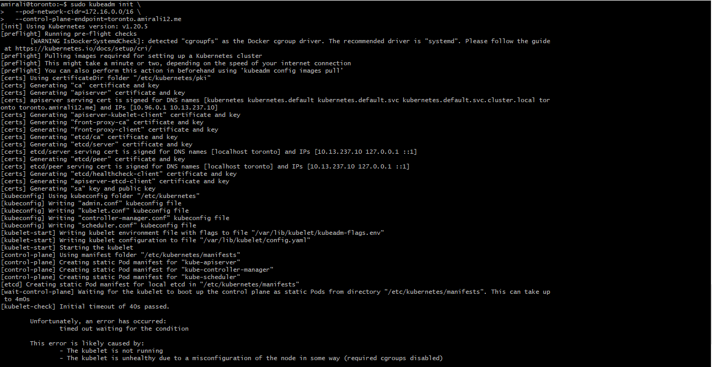                            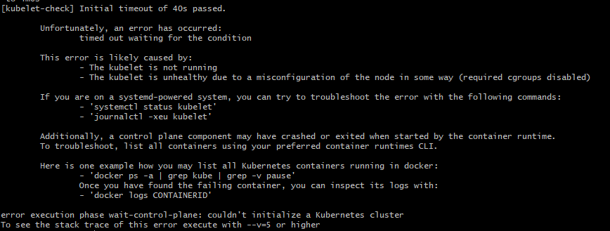

▪️ verifie le context 

 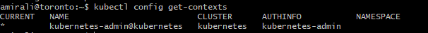
 
 ▪️: Vérifier les noeux
  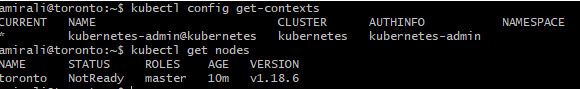
 

## 🃏 Installer le plugin CNI

◾ Sur le serveur du plan de contrôle:

 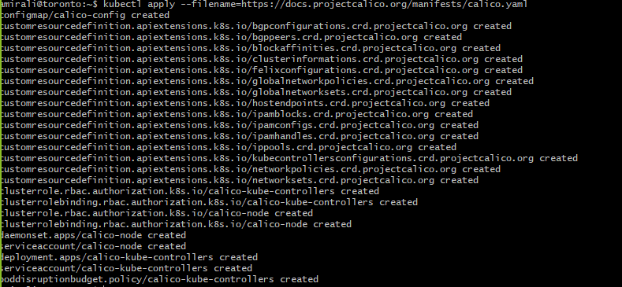
 
 ▪️ Vérifier le service  Kubelet après l'installation du plugin CNI
 
 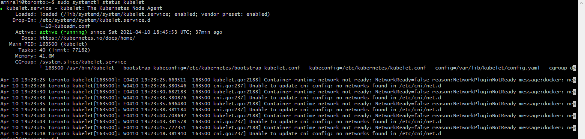
 

