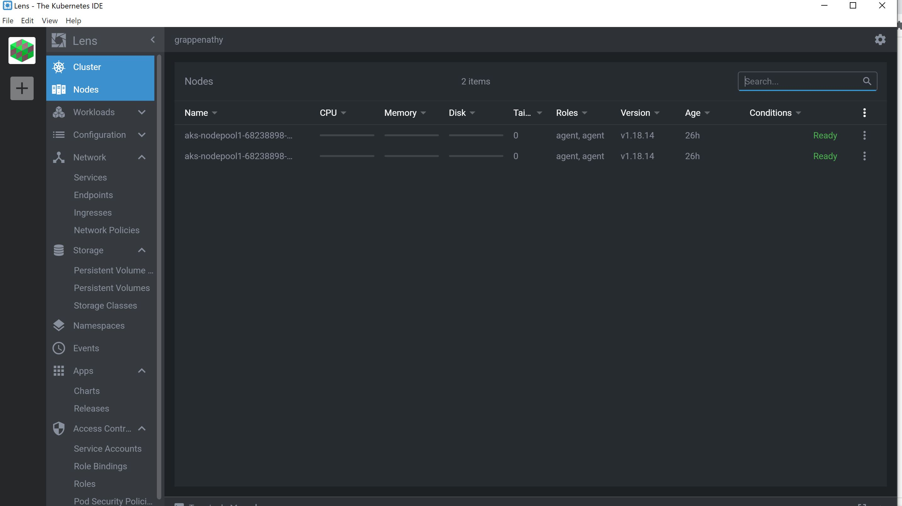
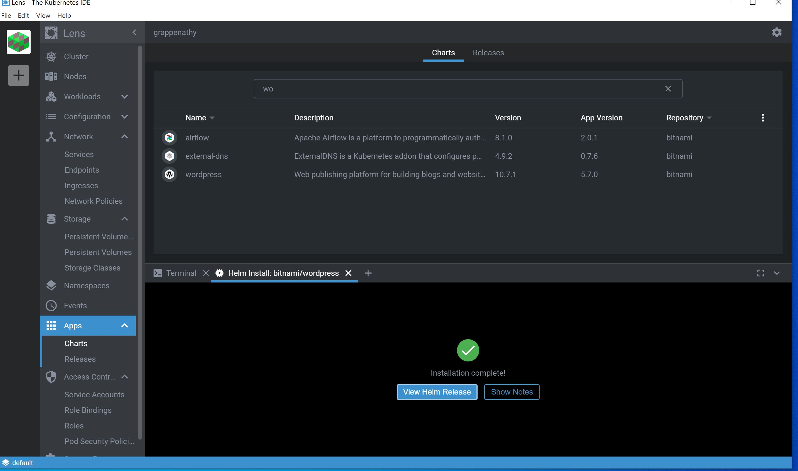
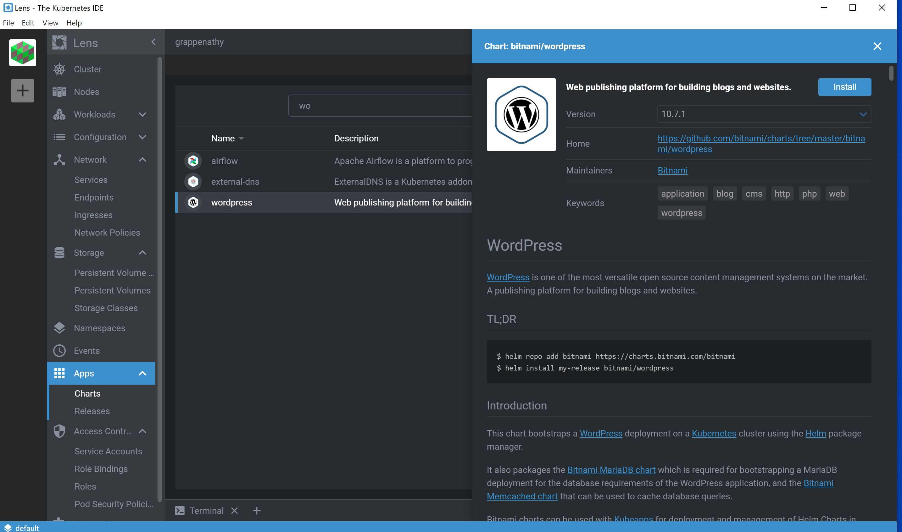
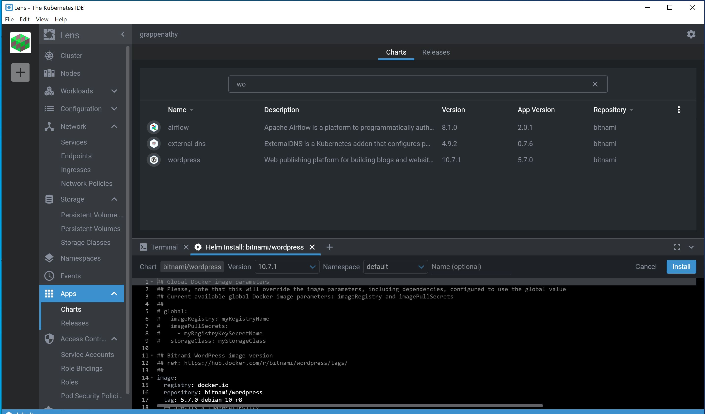
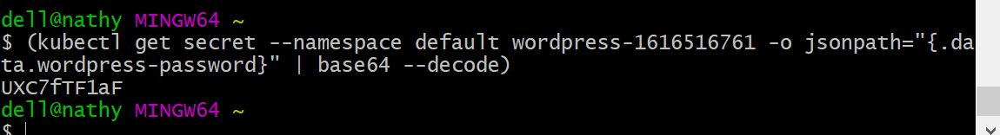
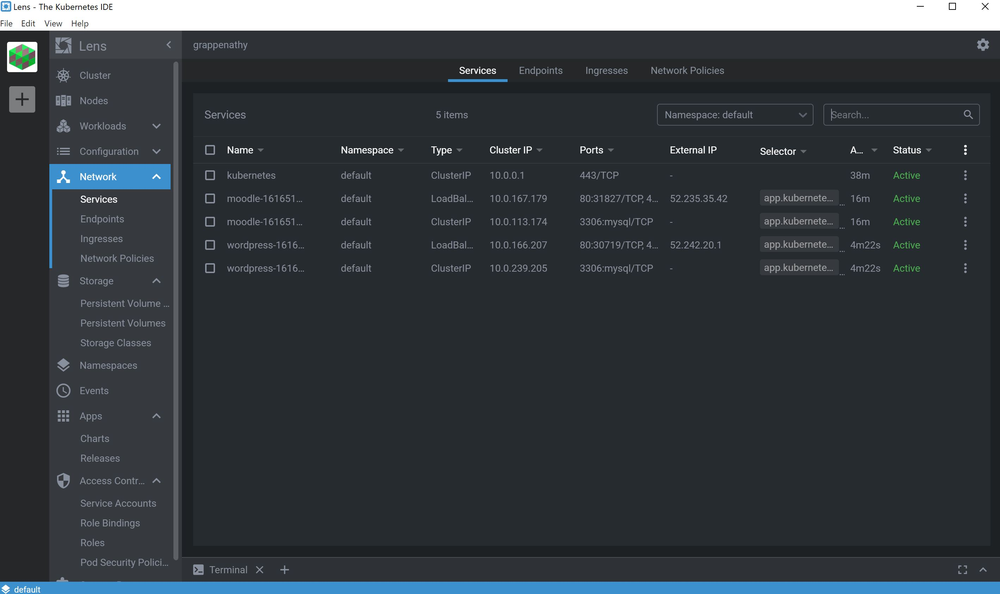
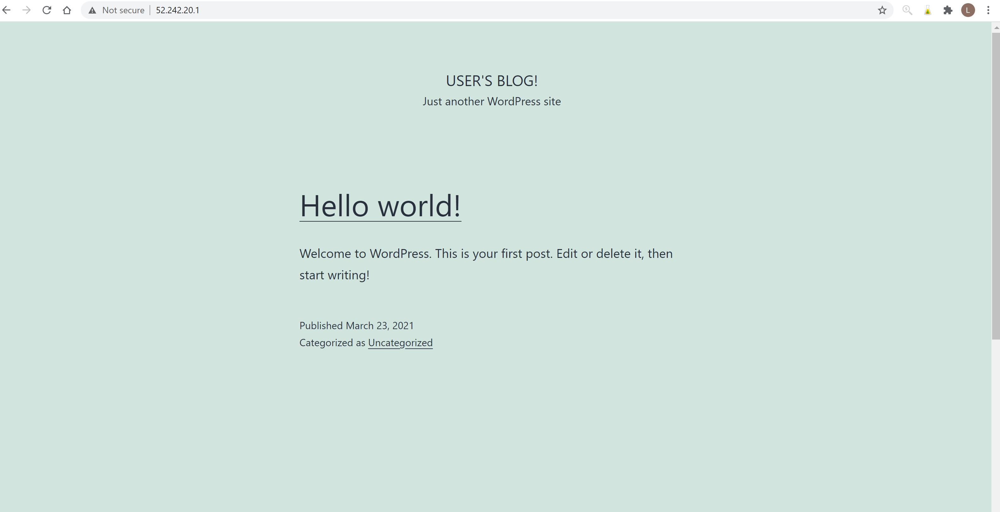
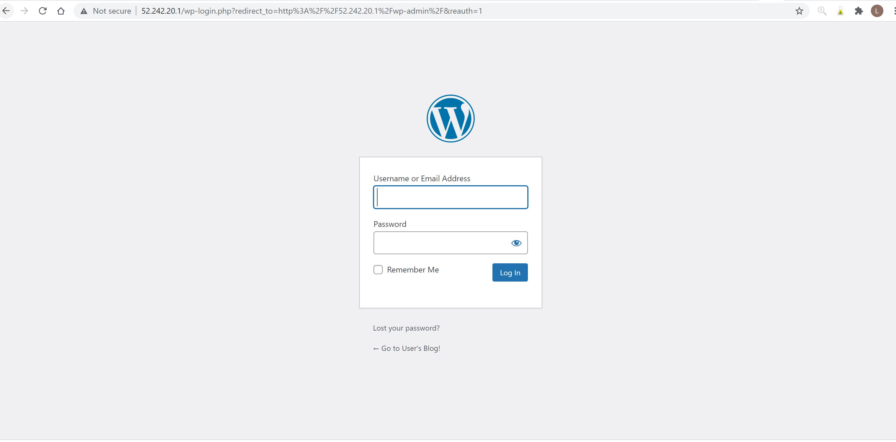
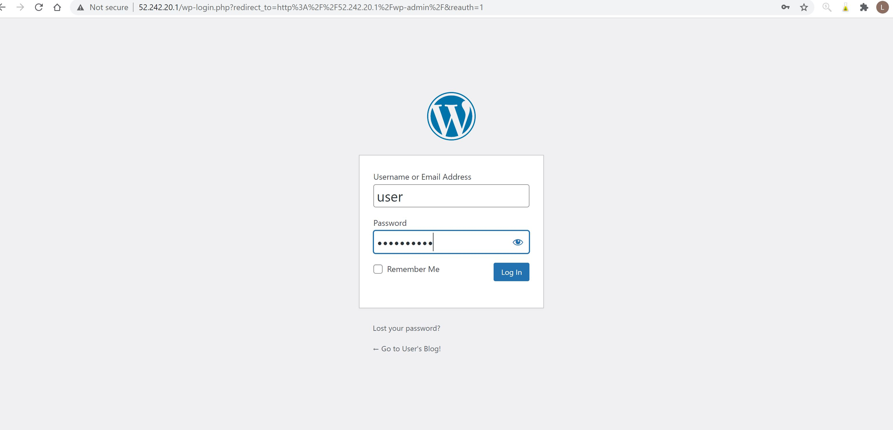
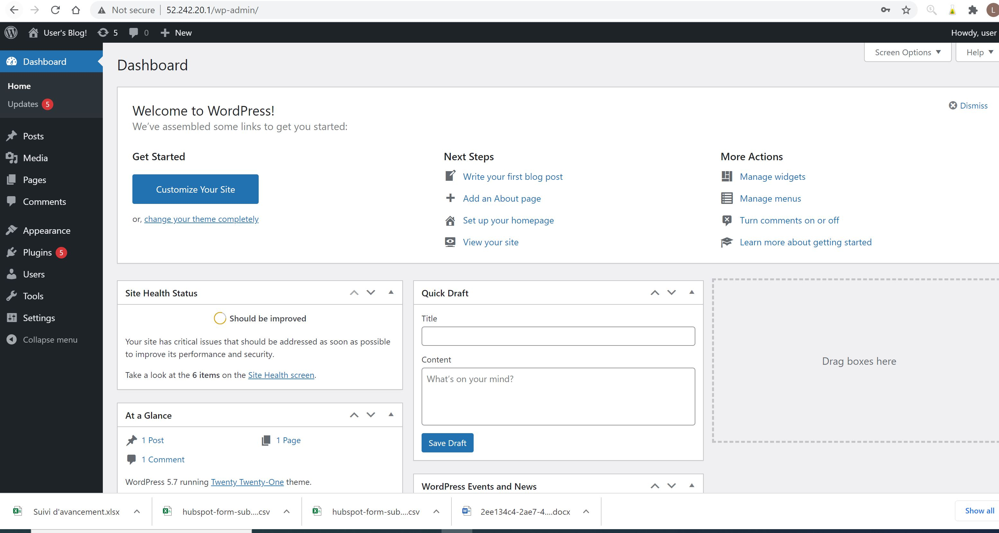

# Installer Wordpress avec Lens

:heavy_check_mark: Au prealable vous devez installer Kubectl et lens sur votre ordinateur. Ensuite vous devez creer la grappe a votre context kubernetes  (Azure Kubernetes services). Pour notre cas nous avons creer deux marchine virtuelle par cluster.

:heavy_check_mark: Dans l'application Lens, allez a apps et choisir Charts une fenetre doit s'ouvrir pour vous permettre d'ecrire le nom de l'application que vous aimeriez installer. Dans notre cas nous avons choisir d'installer Wordpress.

:heavy_check_mark: Lorsque vous choissisez l'application que vous aimeriez installer cette fennetre s'affiche :

:heavy_check_mark: cliquez sur install pour installer l'application :
cette netre s'affiche cliquez sur install

:heavy_check_mark: Puis celle ci s'affiche, cliquez encore sur install

:heavy_check_mark: Ensuite alles de nous a apps et releases pour voir l'application que vous avez installee. le status doit etres deployed.

:heavy_check_mark: Double cliquez sur l'application que vous avez installer; cette fenetre doit s'ouvrir:

:heavy_check_mark: Copier les infrmations qui vont vous permettre d'obtenir votre mot de passe pour vous connecter en tant que qu'administrateur:

:heavy_check_mark: Allez dans git bash et tapez cette commande. Cela va generer automatiquement votre mot de passe que vous allez utiliser.

:heavy_check_mark: cliquez sur network dans lens afin de voir l'adresse ip publique qui vous permettra de consulter wordpress que vous avez installer, ensuite allez dans votre navigateur tapez cet address suivie de admin cette page va s'ouvrir pour vous permettre de d'entre votre credential:

:heavy_check_mark: entre votre credential. voila vous avez reussir a installer wordpress a partir de lens

