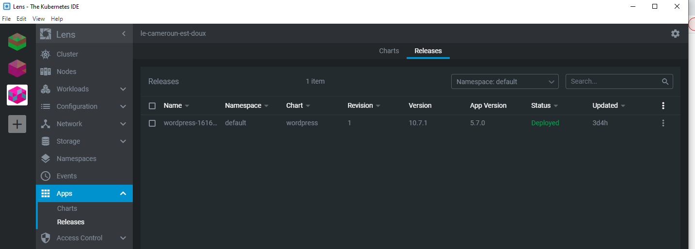

# :rainbow: Installation de WordPress avec Azur Kubernetes

:one: Creation de deux machines virtuelles sur Azure par cluster

-----
:two:Dans Lens selectioner APPS et en suite dans l'onglet de recherche saisi le nom de l'application a installer dans notre cas saisir wordpress

