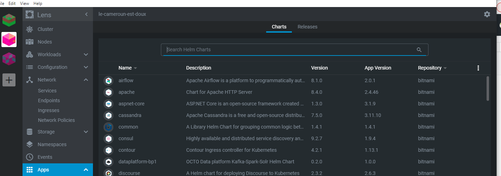
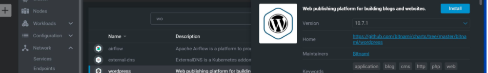
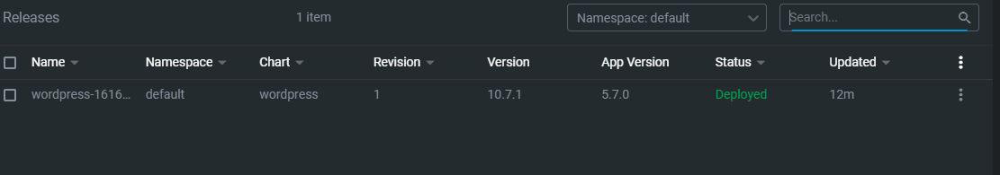

# :rainbow: Installation de WordPress avec Azur Kubernetes

:one: Creation de deux machines virtuelles sur Azure par cluster

-----
:two:Dans Lens selectioner APPS et en suite dans Shart pour choisir l'application a installer 

-----
:three:Verifier que wordpress est installer en cliquant sur APPS puis sur Releases

