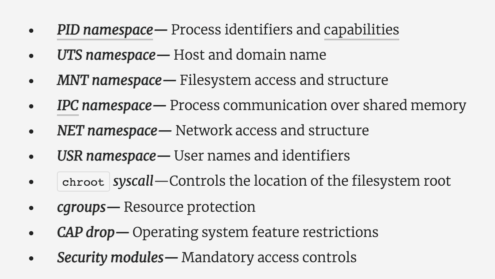
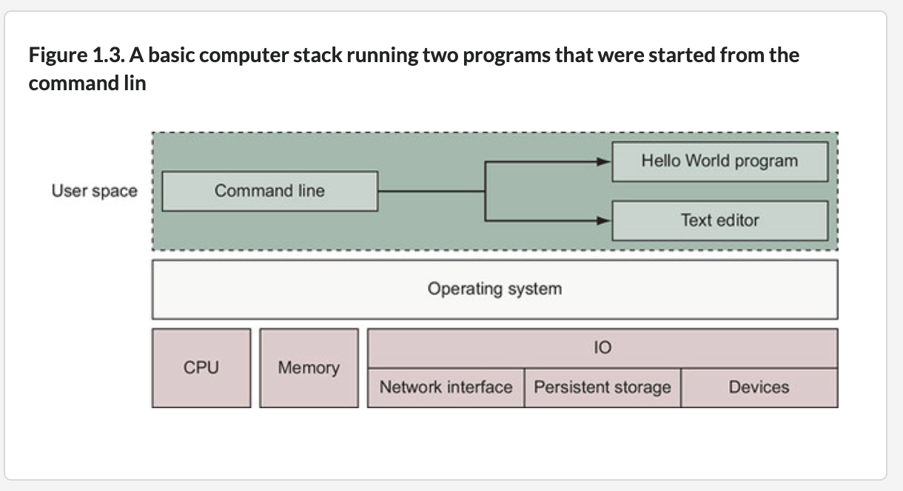
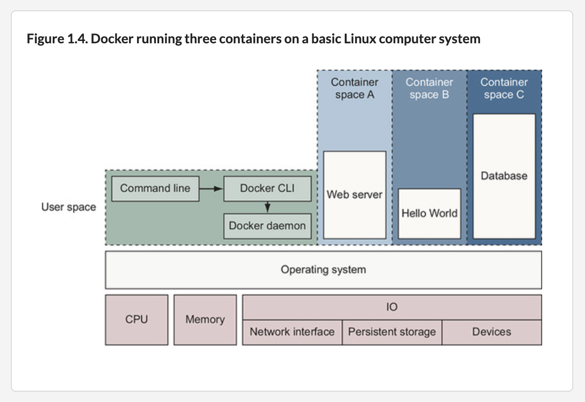
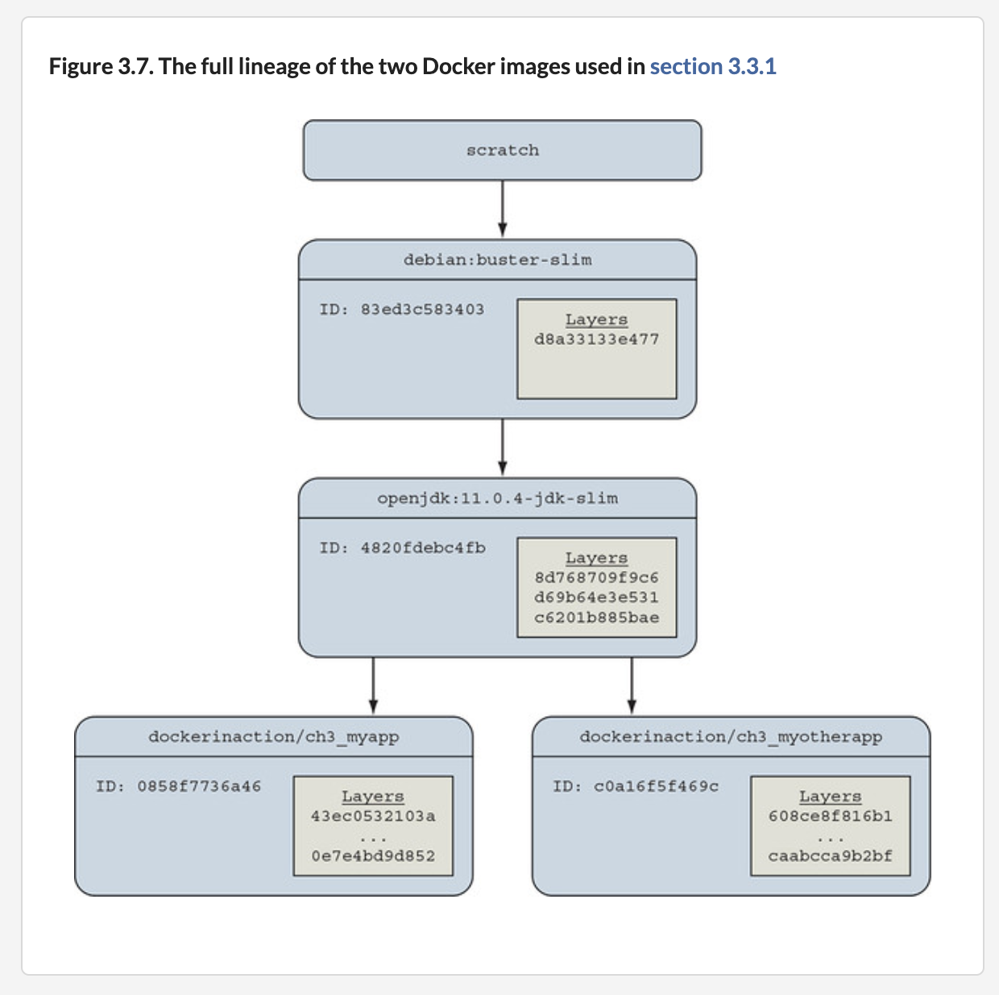

# D.Docker :whale:

[Introduction to docker - 2017 Slides](https://www.slideshare.net/Docker/introduction-to-docker-2017)

## :tv: [Bienvenue dans docker pour les developpeurs](https://www.linkedin.com/learning/docker-pour-les-developpeurs/bienvenue-dans-docker-pour-les-developpeurs?u=56968449)

## :tv: Vidéos de cours

- [ ] [Cycle de vie](https://www.linkedin.com/learning/decouvrir-docker/decouvrir-le-cycle-de-vie-d-un-conteneur?u=56968449)

- [ ] [Image](https://www.linkedin.com/learning/decouvrir-docker/comprendre-les-couches-d-une-image?u=56968449)

</img>

</img>

</img>

</img>

#: :bulb: Dockerfile

comentaires `#`

`FROM` --- Donner une image

`LABEL` --- Donner de l'information

`WORKDIR` -- comme `pwd` le répertoire de travail ou courant 

`ADD` -- ajoute des fichiers (compréssé) ou des répertoires à l'image

`COPY` -- ajoute des fichiers à l'image

`RUN` -- Éxécute les scripts ou installe des librairies ( `apt-get` ou `pip` ) dans l'image

`ENTRYPOINT` -- par défaut éxécute à la fin de l'installation `["/bin/sh"]`. On peut l'`override` (outrepasser ou remplacer)

`CMD` -- permet de rajouter des parametres à la commande `ENTRYPOINT` - de type tableaux [ "param1", "parma2"] 
