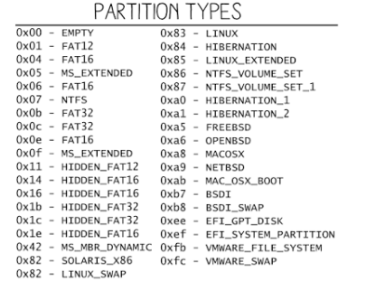

# Revision Test Windows


## :one: Installation Proliant

* Installation sur Proliant GX

  :pushpin: Création de Clé USB:
   
    - Télécharger ISO sur Azure Education
    
    Logicel de boot de clé USB ? ([Rufus](https://github.com/CollegeBoreal/Tutoriels/tree/master/7.Microsoft/servers/ISO), UnetBooting)
    
    Option pour booter la clé : 
    
   :pushpin: Système de fichier (Partition Scheme)
      
    * Master Boot Record [(MBR)](http://www.invoke-ir.com/2015/05/ontheforensictrail-part2.html) 

    * GUID Partition Table (GPT) - 2.2 TB Disks
    
    [:bulb: GPT vs MBR](https://www.howtogeek.com/193669/whats-the-difference-between-gpt-and-mbr-when-partitioning-a-drive)

   * Trouble Shoot quand boot unsuccessful

     [RedScreenOfDeath](https://github.com/CollegeBoreal/Laboratoires/blob/master/3202/proliant/TroubleShoot.md#pushpin-red-screen-of-death) 
     
  :pushpin: Boot
  
     * Basic Input Output System (BIOS)
     
     * Unified Extensible Firmware Interface (UEFI) 
     
      - can boot from drives of 2.2 TB or larger—in fact, the theoretical limit is 9.4 zettabytes
     
     * Preboot Execution Environment (PXE)
     
     [:bulb: BIOS vs UEFI](https://www.howtogeek.com/56958/htg-explains-how-uefi-will-replace-the-bios/)
              
    ISO Choisi ou suggéré
    
    - Windows Server 2019 - [Standard, Essential, Datacenter]
    
    - Windows `Hyper-V` Server 2019
    
   :pushpin: Disques [RAID](https://github.com/CollegeBoreal/Laboratoires/tree/main/3202/proliant/RAID)
   
    - Booter sur RAID Setup Utility `F8`
    
    - RAID :five: exigences
    
      formatter `3` disques minimum
      
    - Créer des disques logiques
    
      soit 3 disques a 146Gb donne 438Gb au final en RAID5 273Gb approxivement 62% de capacité d'utilisation
      
      soit 40% utilisé pour redondance pour `hot swap`
      
    :pushpin: Partition Types
    
    
    
    
    
       ## :x: Reset Proliant 
   
   https://serverfault.com/questions/662448/resetting-factory-defaults-hp-proliant-dl360-gen8
   
```
Actually, Your External USB keys were set to disable, its very simple to fix: remove the cover from your DL360PG8, plug your USB keyboard into the single USB port located "on the motherboard" in front of the power supplies, power up server & wait for F9 BIOS setting to come up at the end of post, here you will be able to get into the F9 settings command from your keyboard, at the 1st drop down menu in the F9 menu click "SYSTEM OPTIONS", scroll down 3 lines to "USB Options" & click, 1st option in the box will be "USB Control" & click on it, a gray box will open with 2 options, click on "USB Enable", after hit "Escape key" 3 times to exit and you will be all set. Good Luck!
```


## :two: Installation de Windows 

https://github.com/CollegeBoreal/Tutoriels/tree/main/O.OS/2.Windows/servers
   
   
      * Passe d'un écran à un autre
      
      - Configuration Language, Clavier et Format Temps Et Devises
      
      - Accepter la license 
      
      - choisir Upgrade ou Custom
      
      - Installation sur le disque (choix de formatter les partitions) - :warning: Boot disk on line
      
      - Déroulement de l'installation (puis reboot)
      
      - Demande le changement de mot de passe de l'administrateur - `Administrator`
      
      - Mot de passe suit une `Politique de sécurité` - 
      
          Règle - Une Majuscule, Une Minuscule, un chiffre, un symbole ($,!) et une taille (6)
          
      - Fenetres de configurations: 
      
        * Script de configuration s'appelle `Sconfig.cmd`
        
        * $HOME directory de l'Administrateur : c:\Users\Administrator
        
        
      - Script Configuration en réseau: (RDP - Remote Desktop)
      
          * Sélection de l'adaptateur réseau (il faut le brancher)
      
          * Changer les nom de la machine (Optionnel)
          
          * Changer la configuration du réseau (IP Statique/Masque/GW/DNS)
          
          * Enable RDP
          
          (Reboot)
          
          


### :o: Remote Desktop

https://github.com/CollegeBoreal/Tutoriels/blob/main/O.OS/2.Windows/servers#utilisation-a-distance

 * Accès coté client
 
    RDP: (Remote Destop Protocol)
    
    * Adresse IP
    
    * Nom
    
    * Mot de passe

    * port TCP `3389`
          
          
# References

[MBR Boot Process](https://neosmart.net/wiki/mbr-boot-process)
      
      
      
      
      
      
      
   
     
    
    
   

